# Comprobaciones Finales

## Validador W3C

Se ha verificado que el w3c fuese valido al realizar la actividad con la descarga del validador dentro de visual studio, ver pantallazos de las validaciones en las webs de [html-validator](https://validator.w3.org/?authuser=0) y [css-validator](https://jigsaw.w3.org/css-validator/)

### Css

- Header

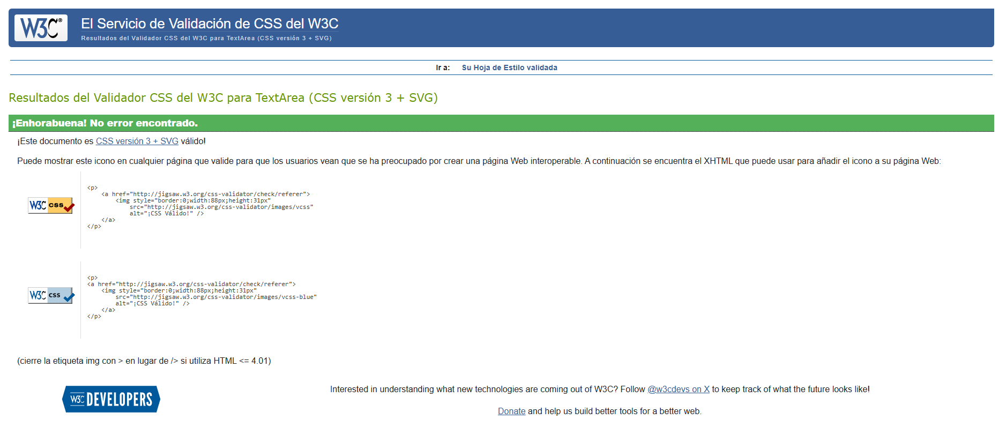

- Main

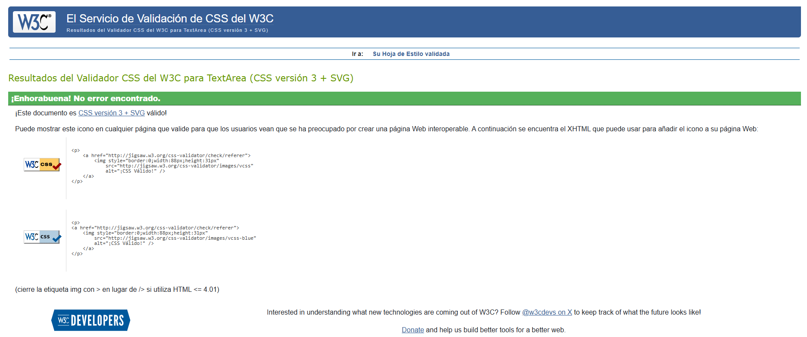

- Footer

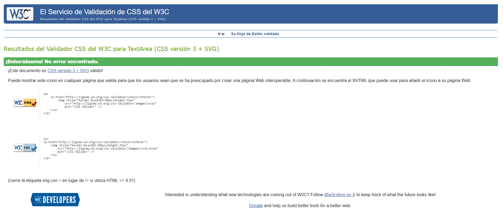

- Queries

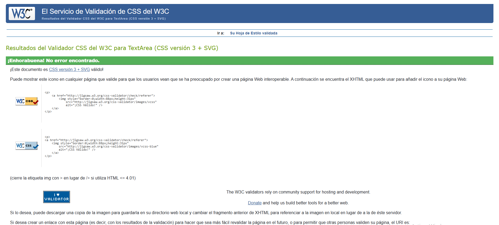

### Html

- Html

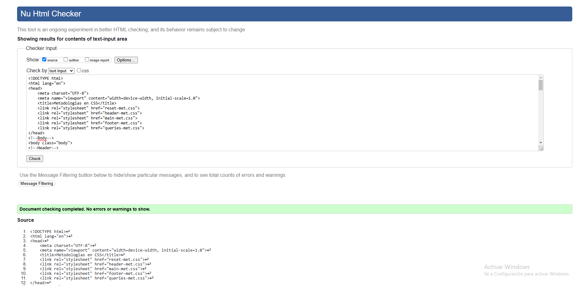

## Calidad del codigo

Realizando la verificacion con la web [code-quality](https://www.projectwallace.com/css-code-quality) dio el resultado de 100 en todos los archivos CSS, ver pantallazos de las verificaciones

- Header

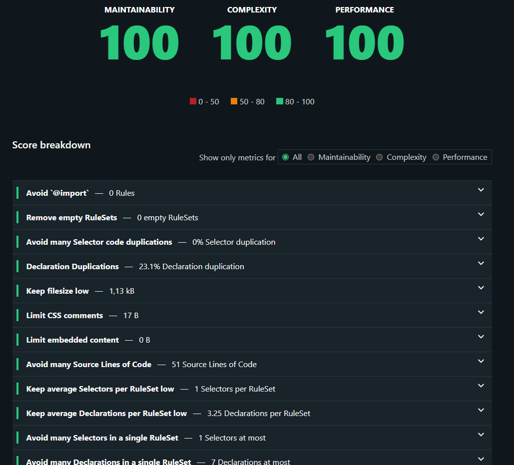

- Main

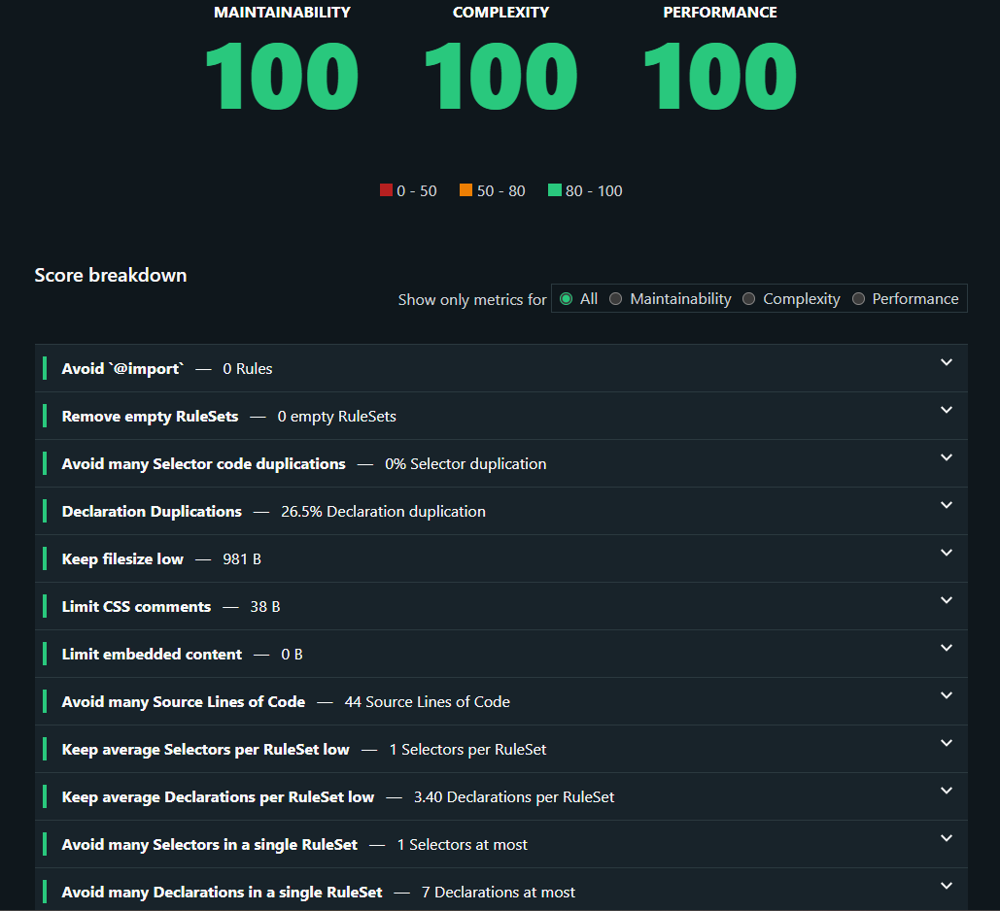

- Footer

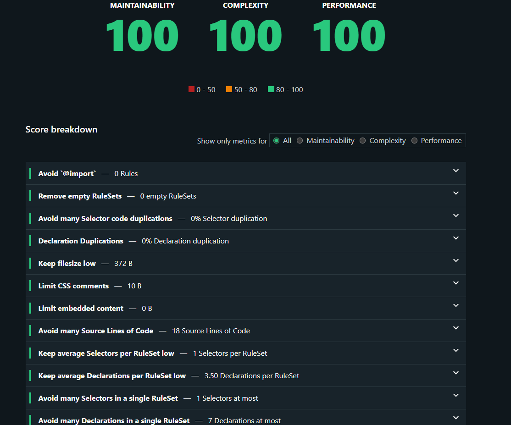

- Queries

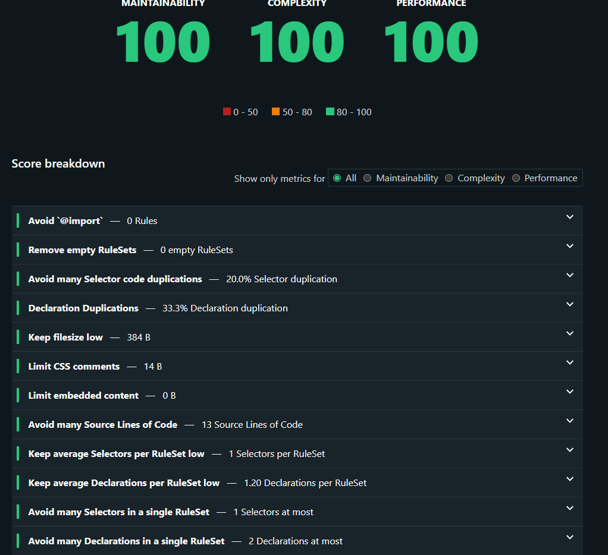

Con la web [yellowtab.tools](https://yellowlab.tools) no me dio resultado, ya que solo reconocia la pagina de github, no revisaba la actividad en la carpeta de github.

## Especificidad del codigo

Con la web [specificity-graph](https://jonassebastianohlsson.com/specificity-graph/) ha dado los siguientes resultados, ver pantallazos

- Header - Linea en 10 sube a 20 con las etiquetas hover.

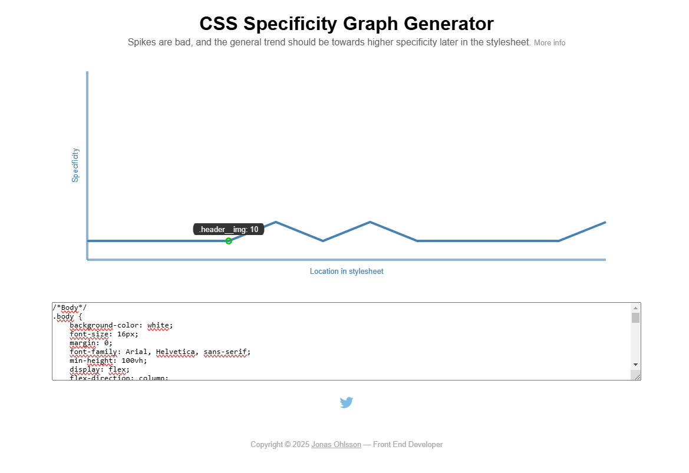

- Main - Linea en 10 sube a 20 con las etiquetas hover.

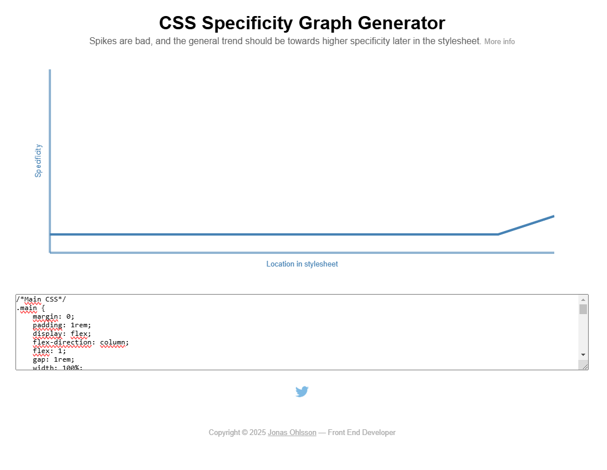

- Footer - Linea en 10 sube a 20 con las etiquetas hover.

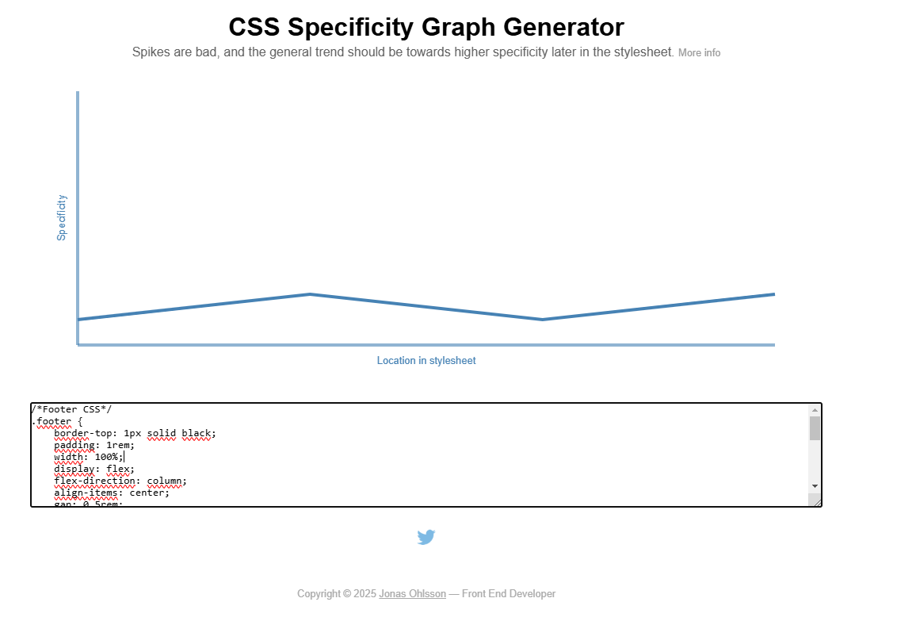

- Queries - Linea plana en 10.

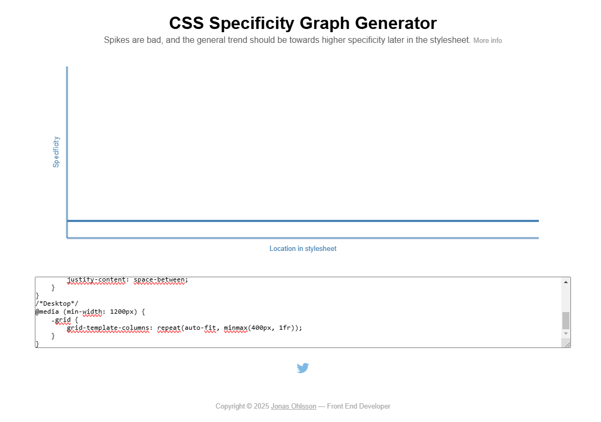

## Optimizacion y velocidad

Resultados con el inspeccionador de Chrome utilizando el audit de lighthouse, ver pantallazos

- He agregado el siguiente codigo para el SEO `<meta name="description" content="Actividad para las comprobaciones finales del proyecto Web">`

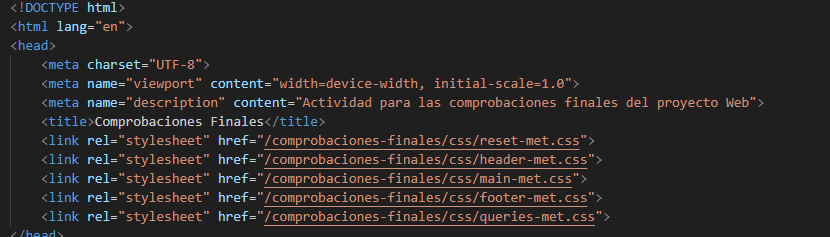

- Da un 98% en accesibilidad por la etiqueta `h4.acticle__h4` he intentado cambiando el orden pero aun no se ha logrado corregir.

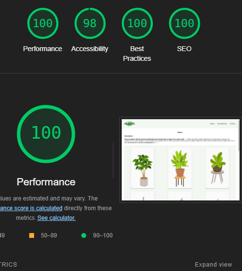

- Use la web [tinypng.com](https://tinypng.com/) para comprimir el peso de las imagenes.

- He agregado el atributo `loading="lazy"` en cada etiqueta `` para que cargue la pagina primero y cargara la imagen cuando sea visible en pantalla.

- Ademas, agregamos en el CSS en las clases de las imagenes del header y el grid `aspect-ratio: auto;` para solventar problemas con lighthouse y optimizar las imagenes.

## Accesibilidad

Con la web [dequeuniversity.com](https://dequeuniversity.com/rules/axe/4.7/color-contrast) he verificado los colores y el contraste, en este caso, solo tengo dos variables de fondo muy claros `white` y `rgb(243, 247, 242);` para el header y el grid. El color de la letra es `black`, ver pantallazo del resultado del contraste

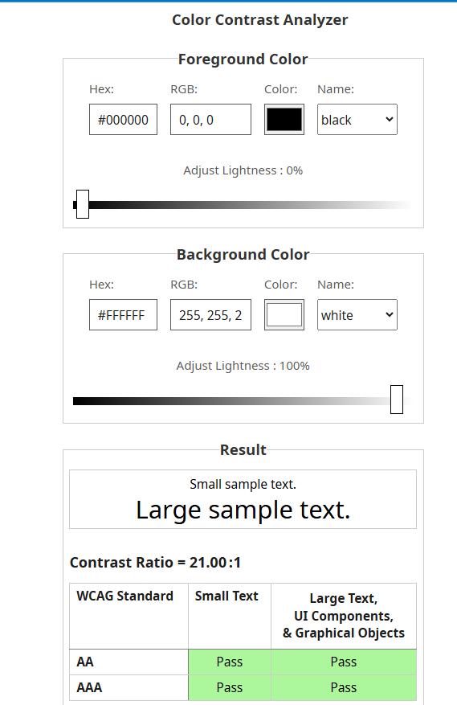

He descargado y revisado los fonts e iconos de Google en la web [Gooegle fonts](https://fonts.google.com/icons?icon.size=24&icon.color=%23e8eaed) para usar las librerias en la proxima actividad.
____________________________________________________________________________________________________________________________________________________________________________________________